PHẦN 11: REPL
Câu hỏi:
 * REPL là gì?
 - REPL là viết tắt của Read-Eval-Print Loop (Đọc-Thực hiện-In ra-Lặp lại), một môi trường tương tác cho phép người dùng nhập lệnh JavaScript và nhận kết quả ngay lập tức

 * Biến _ trong REPL để làm gì?
 - Biến _ trong REPL lưu kết quả của phép tính/lệnh trước đó
  
 * Các lệnh đặc biệt như .help, .exit dùng khi nào?
   - .help: Hiển thị danh sách các lệnh đặc biệt có sẵn trong REPL
   - .exit: Thoát khỏi REPL (cũng có thể dùng Ctrl+D hoặc Ctrl+C hai lần)
 * Mở REPL (node) → thử khai báo biến, dùng _, Tab, .help.
 - mở terminal rồi viết node và khai bao biến
   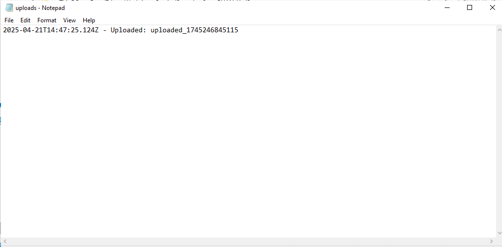
 - dùng  - 
   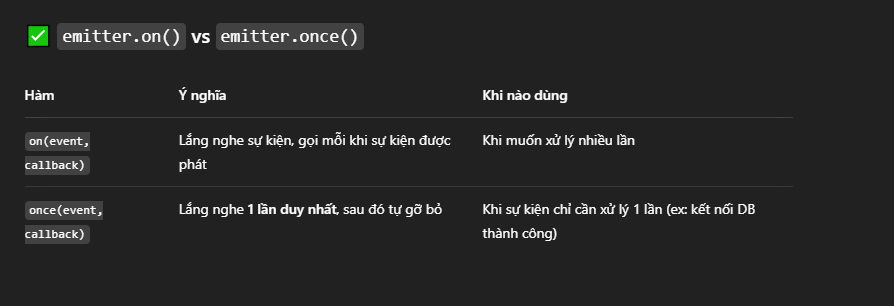
  - Dùng phím Tab để tự động hoàn thành tên biến hoặc thuộc tính

   - Dùng .help để xem các lệnh có sẵn
     
 * 🎯 Bài tập nâng cao:
 
 - Tạo một file repl-helper.js khởi chạy custom REPL:
    
 - Gợi ý (autocomplete) các lệnh tự tạo: sayHi, now, sum(a,b)
   vd: viết chữ s rồi tab sẽ ra sayHi rồi viết thêm 2 dấu () để thành hàm, tương tự với now và sum(a,b).
 - Khi gõ .save thì lưu lịch sử REPL vào file history.txt
     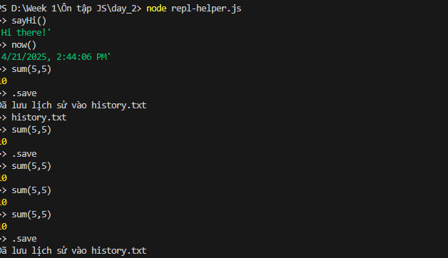
 PHẦN 12–14: Command line
Câu hỏi:
* Làm sao nhận input từ process.argv?
 - process.argv là mảng chứa các tham số dòng lệnh khi chạy chương trình Node.js:
 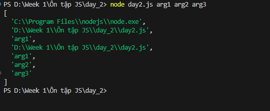
* Khác biệt giữa stdout và stderr?
  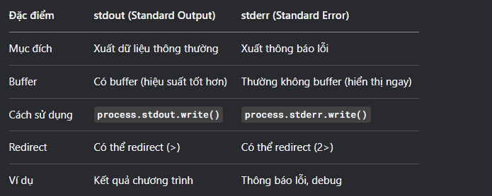
  // Ghi stdout
process.stdout.write('Thông điệp thông thường\n');

// Ghi stderr
process.stderr.write('Thông báo lỗi!\n');
* Cách dùng readline?
  - Module readline giúp đọc input từ terminal:
  Mở trình soạn thảo code (VS Code, Sublime Text, Notepad++)

    1.Tạo file mới với đuôi .js
    2.viết code readline
    3.Lưu file
    4.Mở terminal/command prompt
    5.Di chuyển đến thư mục chứa file
    6.Gõ lệnh node tên_file.js
  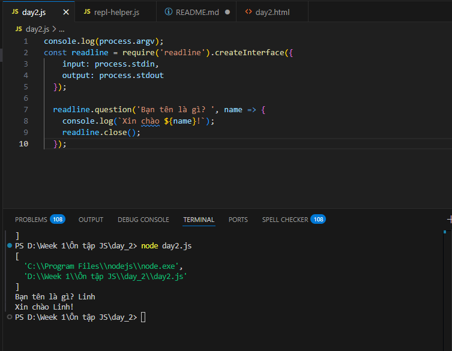
Bài tập nhỏ:
* Viết file sum.js tính tổng 2 số từ dòng lệnh.
  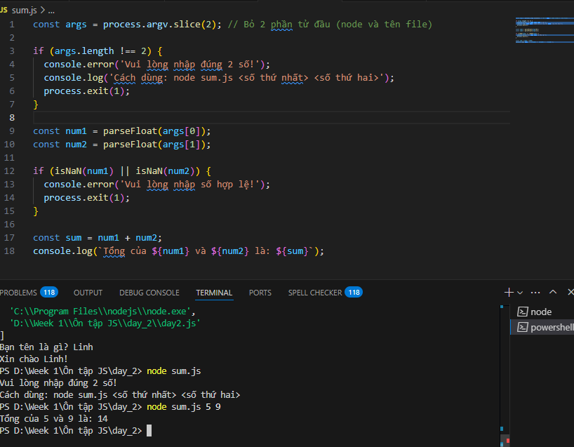
* Dùng readline hỏi tên và in ra Hello <tên>.
  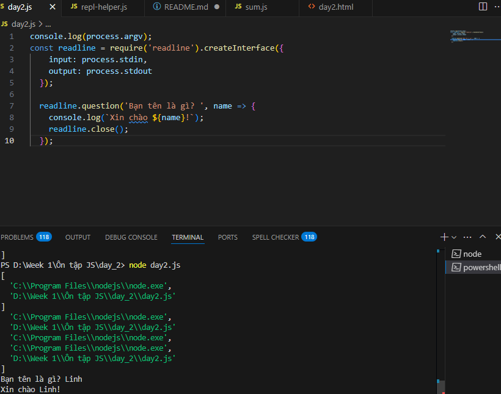
🎯 Bài tập nâng cao:
 * Viết CLI tool csv-summarizer.js và Đọc file, tính tổng, trung bình các cột số.
   
   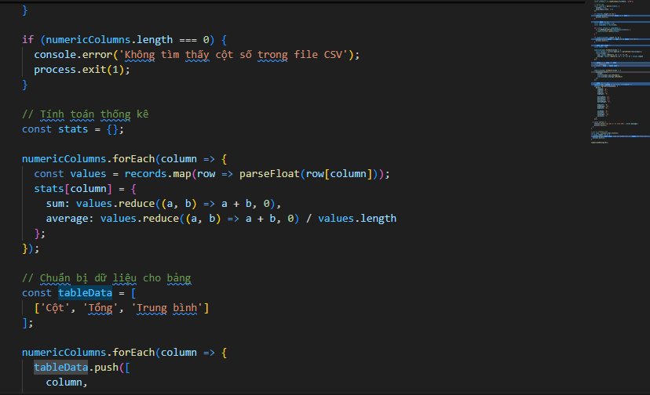
   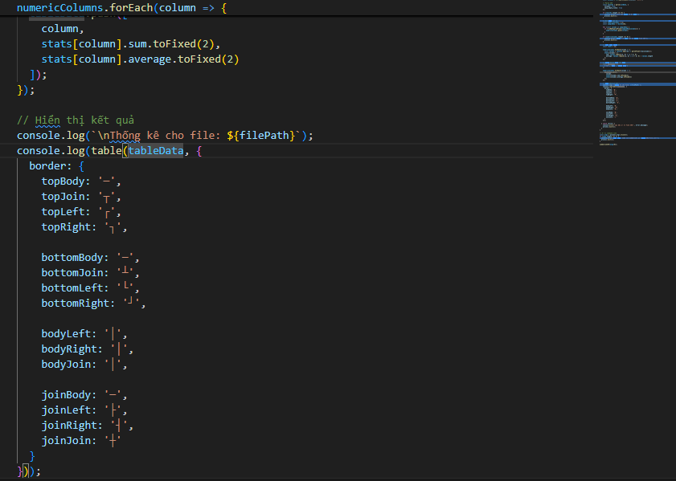
   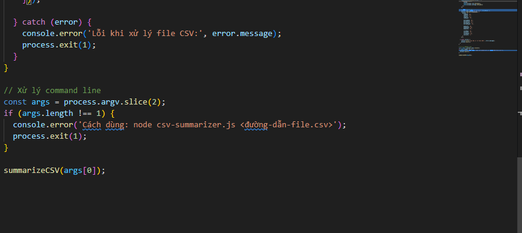
 * Output ra stdout có định dạng bảng.

PHẦN 15–27: npm & npx

Câu hỏi:
 * dependencies vs devDependencies?
    - dependencies: Các gói cần thiết để chạy ứng dụng trong môi trường production (VD: express, react)
    - devDependencies: Các gói chỉ cần cho phát triển (VD: jest, eslint, webpack)
 * Khi nào dùng npx?
    - Khi muốn chạy các gói CLI mà không cần cài đặt global

    - Khi muốn thử nghiệm gói nhanh mà không cần cài đặt

    - Khi muốn chạy phiên bản mới nhất của gói mà không cần cập nhật- 

 * Tác dụng của package-lock.json?
    - Ghi lại chính xác phiên bản các gói đã cài đặt

    - Đảm bảo mọi môi trường cài đặt cùng phiên bản gói

    - Tăng tốc độ cài đặt trong lần sau
Bài tập nhỏ:
 * Tạo package.json, cài chalk, in dòng màu.
    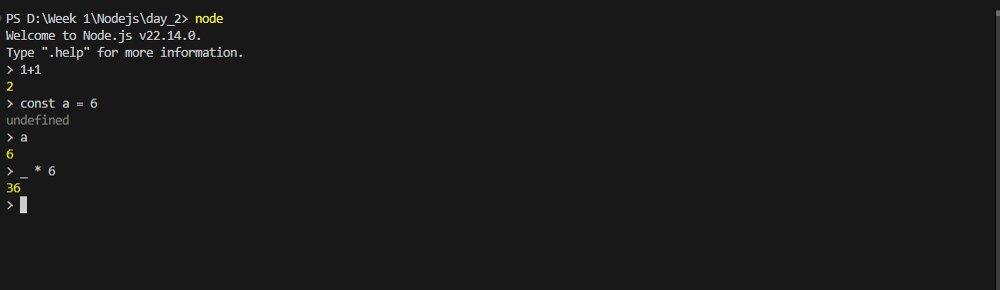
    - in dòng màu
    
 * Tạo script hello gọi bằng npx.
   #!/usr/bin/env node
    Dòng #!/usr/bin/env node rất quan trọng: nó giúp file chạy như một chương trình khi gọi bằng npx.
    console.log("👋 Xin chào từ script npx!");

🎯 Bài tập nâng cao:
Viết 1 CLI tool tên slugify-cli:
   

 * Chuyển chuỗi tiếng Việt thành slug URL (VD: "Xin chào bạn" → xin-chao-ban)
    - cấu trúc thư mục
        slugify-cli/
    ├── lib/
    │   └── slugify.js
    ├── bin/
    │   └── index.js
    ├── package.json
    └── README.md
   
   
    
 * Viết module riêng trong lib/slugify.js
 - Tạo module slugify
        lib/slugify.js
    code:
        function slugify(text) {
    return text
        .toLowerCase()
        .replace(/[áàảãạăắằẳẵặâấầẩẫậ]/g, 'a')
        .replace(/[éèẻẽẹêếềểễệ]/g, 'e')
        .replace(/[íìỉĩị]/g, 'i')
        .replace(/[óòỏõọôốồổỗộơớờởỡợ]/g, 'o')
        .replace(/[úùủũụưứừửữự]/g, 'u')
        .replace(/[ýỳỷỹỵ]/g, 'y')
        .replace(/đ/g, 'd')
        .replace(/\s+/g, '-')
        .replace(/[^\w\-]+/g, '')
        .replace(/\-\-+/g, '-')
        .replace(/^-+/, '')
        .replace(/-+$/, '');
    }

    module.exports = slugify;

 * Export CLI bằng bin/index.js, cho phép chạy bằng npx .
   - Tạo CLI
        bin/index.js
    code:
        #!/usr/bin/env node
    const slugify = require('../lib/slugify');
    const args = process.argv.slice(2);

    if (args.length === 0) {
    console.error('Vui lòng nhập chuỗi cần chuyển đổi');
    console.log('Cách dùng: npx slugify-cli "Chuỗi cần chuyển"');
    process.exit(1);
    }

    const input = args.join(' ');
    console.log(slugify(input));
    - Cấu hình package.json
            {
        "name": "slugify-cli",
        "version": "1.0.0",
        "description": "Công cụ chuyển chuỗi tiếng Việt thành slug URL",
        "main": "lib/slugify.js",
        "bin": {
            "slugify-cli": "./bin/index.js"
        },
        "scripts": {
            "test": "echo \"Error: no test specified\" && exit 1"
        },
        "keywords": ["slug", "vietnamese", "cli"],
        "author": "Your Name",
        "license": "MIT"
        }
        - Cách sử dụng
            bash
            # Cài đặt global (tùy chọn)
            npm install -g .

            # Hoặc chạy trực tiếp bằng npx
            npx slugify-cli "Xin chào các bạn"
            # Output: xin-chao-cac-ban
 PHẦN 28–32: Event Loop
Câu hỏi:
 * process.nextTick() vs setTimeout()?
    process.nextTick()	        setTimeout()
    Thêm vào "next tick queue"	Thêm vào "timer queue"
    Thực thi sau phase hiện tại	Thực thi sau ít nhất 1ms
    Ưu tiên cao nhất	         Ưu tiên thấp hơn nextTick
    Có thể gây starvation	     Không gây starvation

* Stack và queue khác gì nhau?
Call Stack: LIFO (Last In First Out) - nơi thực thi các hàm đồng bộ

Event Queue: FIFO (First In First Out) - nơi chứa các callback bất đồng bộ

Microtask Queue: Ưu tiên cao hơn Event Queue (chứa nextTick và Promise)

* Dùng setImmediate() khi nào?
    Khi muốn thực thi code ngay sau khi event loop hoàn thành phase hiện tại

    Thường dùng để tránh blocking I/O operations

    Ưu tiên thấp hơn nextTick nhưng cao hơn setTimeout(0)

Bài tập nhỏ:
* Viết đoạn code so sánh thứ tự log của nextTick, setTimeout, setImmediate.
    // File: event-order.js
    console.log('Start');

    setTimeout(() => console.log('setTimeout'), 0);

    setImmediate(() => console.log('setImmediate'));

    process.nextTick(() => console.log('nextTick'));

    Promise.resolve().then(() => console.log('Promise'));

    console.log('End');
  * Kết quả mẫu:
        Start
        End
        nextTick
        Promise
        setTimeout
        setImmediate
🎯 Bài tập nâng cao:

* Viết script đo thời gian thực thi:
     
        // benchmark.js
      const iterations = parseInt(process.argv[2], 10) || 100;
      const results = {
        nextTick: [],
        setTimeout: [],
        setImmediate: []
      };
      let completed = 0;

      function runTest() {
        console.log(`Bắt đầu benchmark với ${iterations} lần lặp...`);

        runBenchmark("nextTick", process.nextTick);
        runBenchmark("setTimeout", cb => setTimeout(cb, 0));
        runBenchmark("setImmediate", setImmediate);
      }

      function runBenchmark(type, scheduler) {
        const start = Date.now();
        for (let i = 0; i < iterations; i++) {
          scheduler(() => {
            results[type].push(Date.now() - start);
            if (results[type].length === iterations) {
              logResults(type);
              completed++;
              if (completed === 3) {
                console.log("🏁 Tất cả benchmark đã hoàn thành.");
              }
            }
          });
        }
      }

      function logResults(type) {
        const times = results[type];
        const avg = times.reduce((a, b) => a + b, 0) / times.length;

        console.log(`\n📊 Kết quả ${type}:
      - Số lần hoàn thành: ${times.length}/${iterations}
      - Thời gian trung bình: ${avg.toFixed(2)}ms
      - Nhanh nhất: ${Math.min(...times)}ms
      - Chậm nhất: ${Math.max(...times)}ms
      - Tổng thời gian: ${times[times.length - 1]}ms`);
      }

      runTest();

* Mỗi lần chạy sẽ tạo 100 setTimeout(fn, 0), setImmediate, process.nextTick.
            - Kết Quả:
          Bắt đầu benchmark với 100 lần lặp...

      📊 Kết quả nextTick:
      - Số lần hoàn thành: 100/100
      - Thời gian trung bình: 1.93ms
      - Nhanh nhất: 1ms
      - Chậm nhất: 2ms
      - Tổng thời gian: 2ms

      📊 Kết quả setTimeout:
      - Số lần hoàn thành: 100/100
      - Thời gian trung bình: 4.00ms
      - Nhanh nhất: 4ms
      - Chậm nhất: 4ms
      - Tổng thời gian: 4ms

      📊 Kết quả setImmediate:
      - Số lần hoàn thành: 100/100
      - Thời gian trung bình: 5.00ms
      - Nhanh nhất: 5ms
      - Chậm nhất: 5ms
      - Tổng thời gian: 5ms
      🏁 Tất cả benchmark đã hoàn thành.

 * Ghi lại thứ tự thực thi và tổng thời gian mất bao lâu.
      📊 Kết quả nextTick:
      - Số lần hoàn thành: 100/100
      - Thời gian trung bình: 1.93ms
      - Nhanh nhất: 1ms
      - Chậm nhất: 2ms
      - Tổng thời gian: 2ms

      📊 Kết quả setTimeout:
      - Số lần hoàn thành: 100/100
      - Thời gian trung bình: 4.00ms
      - Nhanh nhất: 4ms
      - Chậm nhất: 4ms
      - Tổng thời gian: 4ms

      📊 Kết quả setImmediate:
      - Số lần hoàn thành: 100/100
      - Thời gian trung bình: 5.00ms
      - Nhanh nhất: 5ms
      - Chậm nhất: 5ms
      - Tổng thời gian: 5ms

 * Bonus: Cho phép config số vòng lặp bằng tham số dòng lệnh.
      - đã bonus 
      có thể chay: node benchmark.js 100,node benchmark.js 500...

PHẦN 33–40: fs, path, os
Câu hỏi:
 * fs.readFileSync() và fs.readFile()?
      

 * path.join() để làm gì?
    - Dùng để kết hợp các phần của đường dẫn lại một cách an toàn theo hệ điều hành.
    const path = require('path');
    const filePath = path.join(__dirname, 'logs', 'log.txt');
    console.log(filePath); // Tự động thêm dấu `/` hoặc `\` đúng chuẩn
 * Dùng os.totalmem() để làm gì?
   - Trả về tổng dung lượng RAM hệ thống (tính bằng byte).
      const os = require('os');
      console.log(`Tổng RAM: ${(os.totalmem() / 1024 / 1024 / 1024).toFixed(2)} GB`);

Bài tập nhỏ:
 * Viết script ghi log.txt với dòng Hello at <timestamp>.
     // log-writer.js
        const fs = require('fs');
        const path = require('path');

        const logMessage = `Hello at ${new Date().toISOString()}\n`;
        const logPath = path.join(__dirname, 'log.txt');

        fs.appendFileSync(logPath, logMessage);
        console.log('✅ Ghi log thành công!');
🎯 Bài tập nâng cao:
 Viết công cụ log-archiver.js:
 * Lấy tất cả file .log trong thư mục /logs
  await ensureDir(archiveDir);

  const files = await fs.readdir(logsDir);
  const logFiles = files.filter(f => f.endsWith('.log'));

  for (const file of logFiles) {
    const filePath = path.join(logsDir, file);
    const newName = formatTimestamp(file);
    const renamedPath = path.join(logsDir, newName);

 * Đổi tên theo format log_YYYYMMDD_HHMM.log
  // Đổi tên file
      await fs.rename(filePath, renamedPath);

      // Đọc nội dung
      const data = await fs.readFile(renamedPath);

 * Nén các log này thành .zip → /archives
    // Nén file
      const zipName = newName.replace('.log', '.zip');
      const zipPath = path.join(archiveDir, zipName);
      const compressed = zlib.gzipSync(data);

      // Ghi file nén
      await fs.writeFile(zipPath, compressed);
      console.log(`✅ Đã nén ${newName} thành ${zipName}`);
  * Kết Quả:
  
Yêu cầu:
 * Dùng fs.promises, path, zlib.

PHẦN 41–43: Event & HTTP
Câu hỏi:
 * emitter.on() vs once()?
  

 * Tạo server đơn giản bằng http.createServer()?
    const http = require('http');

    const server = http.createServer((req, res) => {
        if (req.url === '/hello') {
          res.writeHead(200, { 'Content-Type': 'text/plain' });
          res.end('Xin chào từ server Node.js!');
        } else {
          res.writeHead(404);
          res.end('404 Not Found');
        }
      });

      server.listen(3000, () => console.log('🚀 Server đang chạy tại http://localhost:3000'));
   
 * Cách dùng http.request()? (client gửi request)
      const http = require('http');

    const options = {
      hostname: 'example.com',
      port: 80,
      path: '/path',
      method: 'GET'
    };

    const req = http.request(options, res => {
      console.log(`Status: ${res.statusCode}`);
      res.on('data', chunk => {
        console.log(`Body: ${chunk}`);
      });
    });

    req.on('error', err => {
      console.error('Lỗi:', err);
    });

req.end();

Bài tập nhỏ:
 * Viết EventEmitter custom → log khi event xảy ra.
    const EventEmitter = require('events');
    const emitter = new EventEmitter();

    emitter.on('ping', () => {
      console.log('📢 Ping event received!');
    });

    emitter.emit('ping');

 * Server đơn giản /hello trả về chuỗi.
     const http = require('http');

    http.createServer((req, res) => {
      if (req.url === '/hello') {
        res.writeHead(200, { 'Content-Type': 'text/plain' });
        res.end('Hello, world!');
      } else {
        res.writeHead(404);
        res.end('Not Found');
      }
    }).listen(3000, () => {
      console.log('🟢 Server listening on http://localhost:3000');
    });

   

🎯 Bài tập nâng cao:
 Viết HTTP server không dùng Express:

 * Route POST /upload nhận file bằng multipart/form-data (gợi ý dùng busboy)
 🧩 Cài đặt Busboy:
   npm install busboy
  Code:
        const http = require('http');
      const Busboy = require('busboy');
      const fs = require('fs');
      const path = require('path');
      const EventEmitter = require('events');

      const emitter = new EventEmitter();
      const uploadsDir = path.join(__dirname, 'uploads');
      const logPath = path.join(__dirname, 'uploads.log');

      // Tạo thư mục nếu chưa có
      if (!fs.existsSync(uploadsDir)) {
        fs.mkdirSync(uploadsDir);
      }

      // Ghi log khi upload hoàn tất
      emitter.on('upload:done', filename => {
        const log = `📁 Upload xong: ${filename} - ${new Date().toISOString()}\n`;
        fs.appendFileSync(logPath, log);
      });

      const server = http.createServer((req, res) => {
        if (req.method === 'POST' && req.url === '/upload') {
          const busboy = new Busboy({ headers: req.headers });

          busboy.on('file', (fieldname, file, filename) => {
            const savePath = path.join(uploadsDir, filename);
            file.pipe(fs.createWriteStream(savePath));

            file.on('end', () => {
              emitter.emit('upload:done', filename);
            });
          });

          busboy.on('finish', () => {
            res.writeHead(200, { 'Content-Type': 'text/plain' });
            res.end('✅ Upload thành công');
          });

          req.pipe(busboy);
        } else {
          res.writeHead(404);
          res.end('404 Not Found');
        }
      });

      server.listen(4000, () => {
        console.log('🚀 Server upload đang chạy tại http://localhost:4000/upload');
      });
   
   - tạo 1 file .html
      rồi thêm đoạn test code
    <!DOCTYPE html>
      <html>
      <body>
        <form action="http://localhost:4000/upload" method="POST" enctype="multipart/form-data">
          <input type="file" name="file" required>
          <button type="submit">Upload</button>
        </form>
      </body>
      </html>

 * Khi upload xong, emit sự kiện upload:done, ghi log lại vào file uploads.log.
    Đây là kết quả sau khi upload xong 
    
   

PHẦN 44: Streams
Câu hỏi:
 * Ưu điểm của stream?

 * pipe() làm gì?

C * ó bao nhiêu loại stream?

Bài tập nhỏ:
 * Đọc input.txt → ghi output.txt bằng stream.
Bài tập nâng cao:
 * Viết công cụ thay thế chuỗi trong file lớn:

 * Đọc file lớn bằng stream (fs.createReadStream)

 * Thay thế "ERROR" thành "⚠️ Warning" và ghi lại vào file mới

 * Yêu cầu: xử lý file >100MB mượt mà.

PHẦN 45–46: Env & Error Handling
Câu hỏi:
 * Phân biệt development và production.

 * Dùng try/catch với async/await?

 * Bắt uncaughtException để làm gì?

Bài tập nhỏ:
 * Viết đoạn code chia cho 0 và bắt lỗi.
 Bài tập nâng cao:
 * Tạo middleware xử lý lỗi cho Express:

 * Tự bắt lỗi 404, 500

 * Log lỗi vào file error.log

 * Trả response JSON tùy theo môi trường (dev vs prod)

PHẦN 47–49: HTTP nâng cao
Câu hỏi:
 * GET vs POST khác nhau ở điểm nào?

 * Cách lấy body trong POST request?

 * Dùng http.ServerResponse ra sao?

Bài tập nhỏ:
 * Tạo server Express có route GET /, POST /data lưu data vào mảng.
 Bài tập nâng cao:
 * Tạo REST API quản lý tasks:

 * CRUD: /tasks

 * Mỗi task có deadline, status

 * Tự động kiểm tra deadline quá hạn, chuyển status → "overdue"

Bonus:
 * Dùng middleware kiểm tra auth token (giả lập).

 * Gọi API test bằng Postman hoặc curl.

