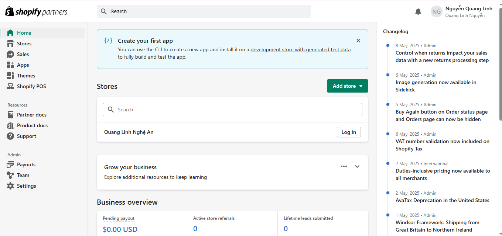
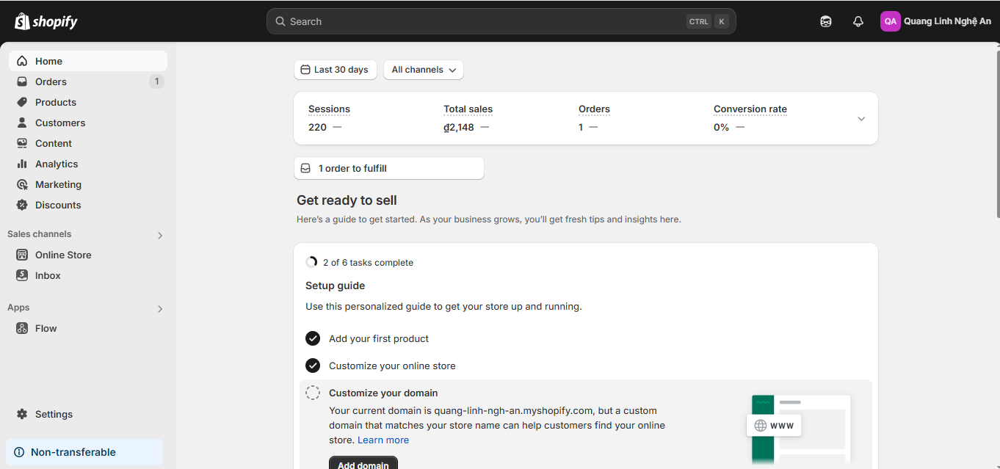
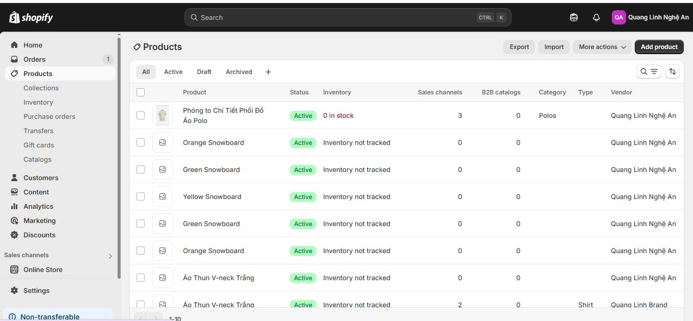
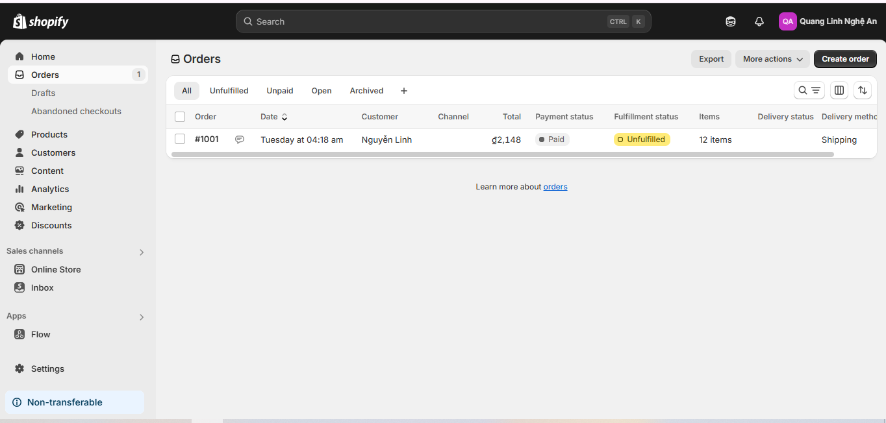
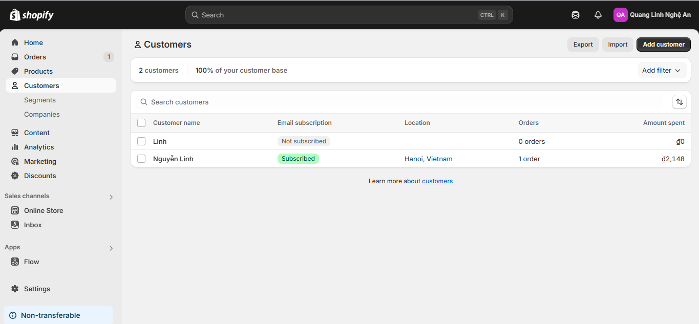
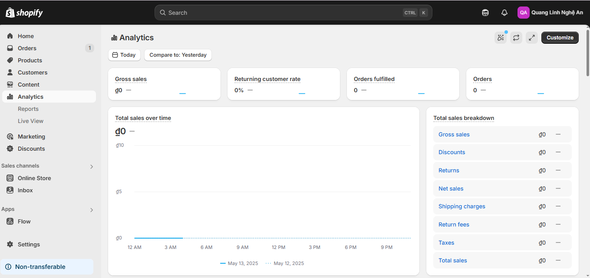
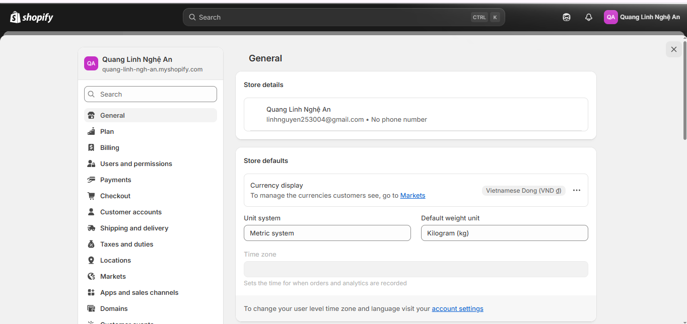

# Day 21: Tổng quan Shopify & Shopify App

## Nội dung chính
- **Shopify là gì? Mô hình hoạt động**: Shopify là một nền tảng thương mại điện tử cho phép người dùng tạo cửa hàng trực tuyến và bán hàng trên nhiều kênh khác nhau. Mô hình hoạt động của Shopify bao gồm việc cung cấp các công cụ để quản lý sản phẩm, đơn hàng, thanh toán và vận chuyển.
- **Các loại Shopify App**:
    - **Public App**: Ứng dụng công khai, có sẵn trên Shopify App Store và có thể được cài đặt bởi bất kỳ cửa hàng nào.
    - **Private App**: Ứng dụng riêng tư, được tạo riêng cho một cửa hàng cụ thể và không có sẵn trên Shopify App Store.
    - **Custom App**: Ứng dụng tùy chỉnh, được phát triển để đáp ứng các nhu cầu đặc thù của một cửa hàng mà không cần phải thông qua Shopify App Store.
- **Shopify Partner, Dev Store, Shopify App Store**:
    - **Shopify Partner**: Chương trình đối tác của Shopify dành cho các nhà phát triển, nhà thiết kế và chuyên gia tiếp thị để xây dựng và phát triển các giải pháp cho Shopify.
    - **Dev Store**: Cửa hàng phát triển miễn phí dành cho đối tác Shopify để thử nghiệm và phát triển ứng dụng hoặc chủ đề.
    - **Shopify App Store**: Nền tảng nơi các ứng dụng công khai được liệt kê để hỗ trợ các cửa hàng Shopify mở rộng tính năng.

## Bài tập
1. Đăng ký **Shopify Partner Account**:
     - Truy cập [Shopify Partner](https://partners.shopify.com/) và tạo tài khoản.
     - Hoàn thành các thông tin cần thiết để kích hoạt tài khoản.
    
    - Truy cập trang đăng ký Shopify Partner Account.
    - Điền thông tin cần thiết như email, mật khẩu, và tên doanh nghiệp.
    - Nhấn nút "Sign Up" để hoàn tất quá trình đăng ký.
        
2. Tạo **Dev Store** đầu tiên:
     - Đăng nhập vào tài khoản Shopify Partner.
     - Tạo một cửa hàng phát triển mới từ bảng điều khiển.
     - Cấu hình các thông tin cơ bản cho cửa hàng.
3. Khám phá **Admin Dashboard** và các tính năng:
    - **Trang chủ (Home)**: Đây là nơi bạn có thể xem tổng quan về cửa hàng của mình, bao gồm các thông báo quan trọng, hiệu suất bán hàng, và các gợi ý từ Shopify để cải thiện hoạt động kinh doanh.
    
    - **Sản phẩm (Products)**: Quản lý danh sách sản phẩm, thêm mới, chỉnh sửa hoặc xóa sản phẩm. Bạn có thể thiết lập giá, hình ảnh, mô tả, và các thuộc tính khác của sản phẩm.
    
    - **Đơn hàng (Orders)**: Theo dõi và quản lý các đơn hàng từ khách hàng, bao gồm trạng thái đơn hàng, thông tin thanh toán, và vận chuyển.
    
    - **Khách hàng (Customers)**: Quản lý thông tin khách hàng, bao gồm lịch sử mua hàng, thông tin liên hệ, và phân loại khách hàng.
    
    - **Phân tích (Analytics)**: Xem các báo cáo và số liệu thống kê về hiệu suất cửa hàng, bao gồm doanh thu, lưu lượng truy cập, và hành vi khách hàng.
     
    - **Cài đặt (Settings)**: Tùy chỉnh các thiết lập của cửa hàng như phương thức thanh toán, vận chuyển, thuế, và các tùy chọn khác để phù hợp với nhu cầu kinh doanh.
    
4. Cài thử **1 public app** vào store test:
    miễn phí từ Shopify App Store. Dưới đây là diễn giải từng bước:

Truy cập Shopify App Store

Mở trình duyệt và truy cập vào Shopify App Store. Đây là nơi chứa các ứng dụng hỗ trợ mở rộng tính năng cho cửa hàng Shopify.
Chọn một ứng dụng công khai miễn phí và cài đặt vào Dev Store

Tìm kiếm một ứng dụng miễn phí trong Shopify App Store.
Đảm bảo rằng bạn đang sử dụng một Dev Store (cửa hàng phát triển) để cài đặt ứng dụng. Dev Store thường được sử dụng bởi các nhà phát triển để thử nghiệm mà không ảnh hưởng đến cửa hàng thực tế.
Nhấn nút "Add app" (Thêm ứng dụng) và làm theo hướng dẫn để cài đặt ứng dụng vào Dev Store.
Kiểm tra các tính năng của ứng dụng sau khi cài đặt

Sau khi cài đặt, truy cập vào giao diện quản trị của Dev Store.
Mở ứng dụng vừa cài đặt và kiểm tra các tính năng mà ứng dụng cung cấp. Điều này có thể bao gồm việc cấu hình ứng dụng, thử nghiệm các chức năng chính, hoặc xem cách ứng dụng tương tác với cửa hàng của bạn.
Nếu bạn cần thêm thông tin hoặc gặp vấn đề trong quá trình thực hiện, hãy cho mình biết!
### Ví dụ: Cài đặt ứng dụng Trustoo.io

1. **Truy cập Shopify App Store**:
    - Mở trình duyệt và truy cập vào [Shopify App Store](https://apps.shopify.com/).
    - Tìm kiếm ứng dụng **Trustoo.io** bằng cách nhập từ khóa "Trustoo.io" vào thanh tìm kiếm.

2. **Chọn ứng dụng và cài đặt**:
    - Nhấp vào ứng dụng **Trustoo.io - Product Reviews** trong danh sách kết quả.
    - Nhấn nút **"Add app"** (Thêm ứng dụng) để bắt đầu quá trình cài đặt.
    - Đăng nhập vào **Dev Store** của bạn nếu được yêu cầu.

3. **Xác nhận cài đặt**:
    - Xem lại các quyền mà ứng dụng yêu cầu.
    - Nhấn **"Install app"** (Cài đặt ứng dụng) để hoàn tất quá trình.

4. **Cấu hình ứng dụng**:
    - Sau khi cài đặt, mở ứng dụng **Trustoo.io** từ giao diện quản trị của Dev Store.
    - Làm theo hướng dẫn để thiết lập các tính năng như hiển thị đánh giá sản phẩm, tùy chỉnh giao diện, hoặc nhập đánh giá từ các nguồn khác.

5. **Kiểm tra tính năng**:
    - Truy cập trang sản phẩm trên cửa hàng của bạn để kiểm tra xem đánh giá sản phẩm đã hiển thị đúng cách chưa.
    - Thử nghiệm các tùy chọn cấu hình trong ứng dụng để đảm bảo mọi thứ hoạt động như mong đợi.

6. **Hoàn tất**:
    - Nếu gặp bất kỳ vấn đề nào, bạn có thể liên hệ với đội ngũ hỗ trợ của **Trustoo.io** thông qua trang ứng dụng trên Shopify App Store.

