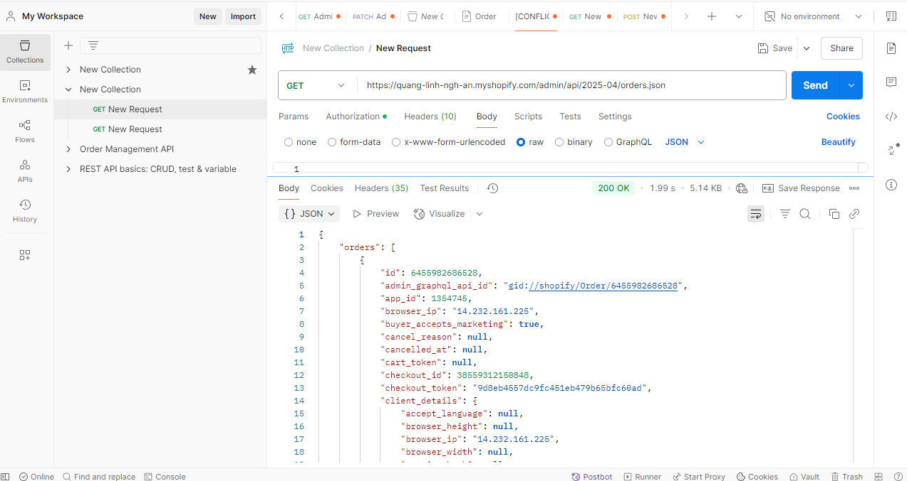

# Day 22: Shopify API Overview (REST - GraphQL)

## Nội dung chính

### 1. REST API vs GraphQL API
- **REST API**: Dựa trên các endpoint cố định, mỗi endpoint phục vụ một mục đích cụ thể. Dữ liệu trả về thường dư thừa vì không thể tùy chỉnh.
- **GraphQL API**: Cho phép truy vấn dữ liệu linh hoạt, chỉ lấy những trường cần thiết. Giảm thiểu số lượng request và dữ liệu không cần thiết.

### 2. Các API quan trọng
- **Product API**: Quản lý sản phẩm (tạo, sửa, xóa, lấy danh sách sản phẩm).
- **Customer API**: Quản lý khách hàng (thêm, sửa, xóa, lấy thông tin khách hàng).
- **Order API**: Quản lý đơn hàng (tạo, sửa, lấy danh sách đơn hàng).

### 3. Tìm hiểu các API Shopify cung cấp cho App
- Shopify cung cấp nhiều API để tích hợp ứng dụng, bao gồm:
    - Admin API (REST và GraphQL).
    - Storefront API.
    - Billing API.
    - Webhooks API.

### 4. Giới hạn khi gọi API
- **Rate Limit**: Shopify giới hạn số lượng request trong một khoảng thời gian.
    - REST API: 40 requests/giây.
    - GraphQL API: Sử dụng hệ thống điểm (cost-based).
- **Scope**: Quyền truy cập API cần được cấp đúng phạm vi (scope) khi cài đặt app.

### 5. Phân tích REST API vs GraphQL API
- REST API dễ sử dụng hơn cho các tác vụ đơn giản.
- GraphQL API phù hợp với các ứng dụng phức tạp, cần tối ưu hóa dữ liệu.

### 6. Hiểu về Rate Limit và tính toán limit
- REST API: Theo dõi số lượng request còn lại qua header `X-Shopify-Shop-Api-Call-Limit`.
- GraphQL API: Tính toán điểm tiêu tốn qua header `X-GraphQL-Cost-Included`.

### 7. Phân quyền scope
- Đảm bảo yêu cầu đúng scope khi cài đặt app (ví dụ: `read_products`, `write_orders`).
- Scope thiếu sẽ dẫn đến lỗi khi gọi API.

### 8. Các lỗi thực tế khi phát triển app
- **Vượt limit**: Gây lỗi 429 (Too Many Requests).
- **Thiếu scope**: Gây lỗi 403 (Forbidden).
- **Lỗi API khi thiếu dữ liệu**: Gây lỗi 400 (Bad Request).

### 9. Xử lý lỗi và retry logic
- Sử dụng cơ chế retry với thời gian chờ tăng dần (exponential backoff).
- Kiểm tra header `Retry-After` để biết thời gian chờ.

### 10. Hiểu OAuth flow cơ bản
- OAuth flow giúp lấy access token để gọi API.
- Các bước cơ bản:
    1. Redirect người dùng đến trang cài đặt app.
    2. Shopify trả về `code` qua callback URL.
    3. Gửi `code` để lấy access token.

### 11. Giới thiệu Postman test Shopify API
- Postman là công cụ hữu ích để kiểm tra API.
- Hỗ trợ gửi request, kiểm tra response, và debug lỗi.

---

## Bài tập

### 1. Test API trên Postman
#### a. Lấy danh sách products
- Endpoint: `GET /admin/api/2025-04/orders.json`

- Headers:
    - `X-Shopify-Access-Token`: `<access_token>`
- Response: Danh sách sản phẩm.

#### b. Lấy thông tin 1 product
- Endpoint: `GET /admin/api/2025-04/products/{product_id}.json`
- Headers:
    - `X-Shopify-Access-Token`: `<access_token>`
- Response: Thông tin chi tiết của sản phẩm.

### 2. Tìm hiểu OAuth Flow
- Mục tiêu: Hiểu cơ chế lấy access token.
- Thực hiện:
    1. Tạo app trên Shopify Partner Dashboard.
    2. Cấu hình callback URL.
    3. Thực hiện các bước OAuth flow để lấy token.

---

## Ghi chú
- Đọc kỹ tài liệu chính thức của Shopify: [Shopify API Documentation](https://shopify.dev/docs/api).
- Sử dụng Postman để kiểm tra và debug các lỗi API.
- Đảm bảo app được cấp đúng scope trước khi gọi API.
