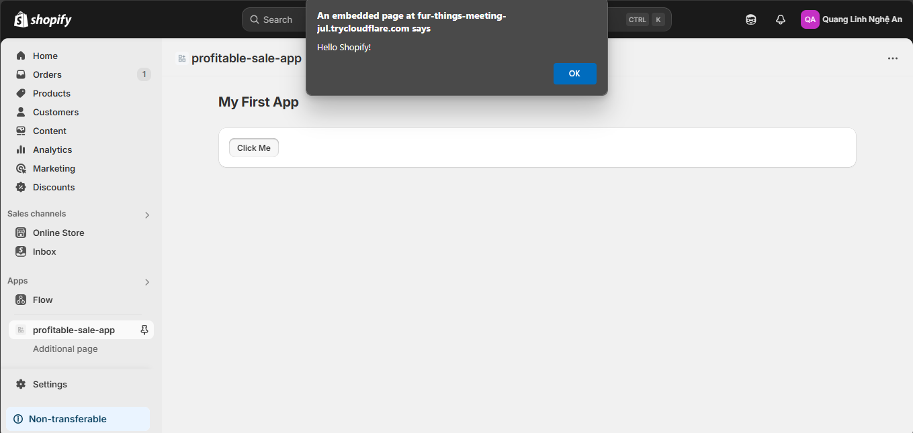

# Day 23: Làm Quen Shopify CLI & Tạo App Mẫu

## Nội Dung Chính

### 1. Cài Đặt Shopify CLI
Shopify CLI là công cụ dòng lệnh giúp bạn dễ dàng tạo và quản lý các ứng dụng Shopify. Để cài đặt Shopify CLI, bạn thực hiện các bước sau:
1. **Cài đặt Node.js**: Đảm bảo bạn đã cài đặt Node.js trên máy tính. Bạn có thể tải Node.js từ [trang chủ Node.js](https://nodejs.org/).
2. **Cài đặt Shopify CLI**: Chạy lệnh sau trong terminal:
    ```bash
    npm install -g @shopify/cli @shopify/theme
    ```
3. **Kiểm tra cài đặt**: Sau khi cài đặt, kiểm tra phiên bản Shopify CLI bằng lệnh:
    ```bash
    shopify version
    ```

### 2. Khởi Tạo Project App Bằng CLI
Để bắt đầu tạo một ứng dụng Shopify, bạn thực hiện các bước sau:
1. **Khởi tạo ứng dụng**:
    ```bash
    shopify app create node
    ```
    - Chọn loại framework (ví dụ: Node.js).
    - Nhập tên ứng dụng.
    - Chọn các tùy chọn bổ sung nếu cần.
2. **Chạy ứng dụng**:
    ```bash
    shopify app dev
    ```
    Lệnh này sẽ khởi chạy ứng dụng trên môi trường local và cung cấp URL ngrok để bạn có thể kiểm tra.

### 3. Tìm Hiểu Cấu Trúc Folder Project
Sau khi khởi tạo, bạn sẽ thấy cấu trúc thư mục như sau:
- **/web**: Chứa mã nguồn backend (Node.js).
- **/frontend**: Chứa mã nguồn frontend (React).
- **/extensions**: Chứa các phần mở rộng (nếu có).
- **shopify.app.toml**: File cấu hình chính của ứng dụng.

## Bài Tập

### 1. Tạo App Mẫu Chạy Local
- Sử dụng Shopify CLI để tạo một ứng dụng mẫu.
- Chạy ứng dụng bằng lệnh `shopify app dev` và kiểm tra trên URL ngrok.

### 2. Cài Polaris Hiển Thị 1 UI Component Mẫu
Polaris là thư viện giao diện của Shopify. Để cài đặt và sử dụng Polaris:
1. **Cài đặt Polaris**:
    ```bash
    npm install @shopify/polaris
    ```
2. **Thêm Polaris vào ứng dụng**:
    - Mở file `index.js` hoặc `App.js` trong thư mục frontend.
    - Import Polaris và áp dụng theme:
      ```javascript
      import {AppProvider, Button, Card} from '@shopify/polaris';
      import '@shopify/polaris/build/esm/styles.css';

      function App() {
         return (
            <AppProvider>
              <Card title="Welcome">
                 <Button onClick={() => alert('Hello Polaris!')}>Click Me</Button>
              </Card>
            </AppProvider>
         );
      }

      export default App;
      ```
      
3. **Chạy lại ứng dụng**:
    ```bash
    shopify app dev
    ```
    Kiểm tra giao diện để đảm bảo Button và Card hiển thị đúng.

Chúc bạn hoàn thành tốt bài tập và hiểu rõ hơn về Shopify CLI!