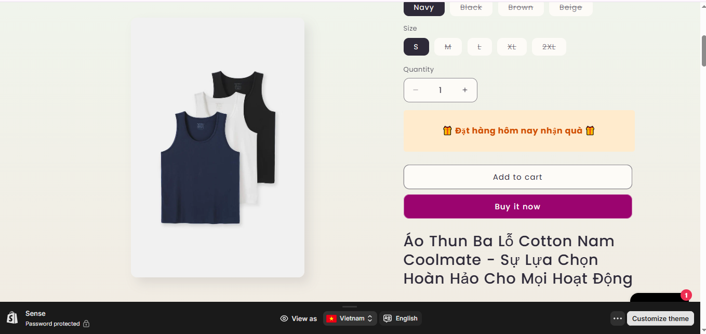

# Day 24: Shopify Theme & Storefront Interaction

## Nội dung chính
- **Tổng quan Shopify Theme**: Liquid, Sections, JSON Template
- **Cách App tương tác với Storefront**
- **Cài đặt ScriptTag, App Block vào Theme**

---

## Bài tập chi tiết

### 1. Inject 1 ScriptTag vào theme product page (hiển thị message "Đặt hàng hôm nay nhận quà")

#### Bước 1: Tạo ScriptTag trong App
- Trong backend của App, sử dụng API của Shopify để tạo một ScriptTag.
- Ví dụ với Node.js:

```javascript
const createScriptTag = async (shop, accessToken) => {
    const url = `https://${shop}/admin/api/2023-01/script_tags.json`;
    const scriptTagPayload = {
        script_tag: {
            event: "onload",
            src: "https://your-app-url.com/message.js",
        },
    };

    const response = await fetch(url, {
        method: "POST",
        headers: {
            "Content-Type": "application/json",
            "X-Shopify-Access-Token": accessToken,
        },
        body: JSON.stringify(scriptTagPayload),
    });

    return response.json();
};
```

#### Bước 2: Tạo file `message.js` trên server của bạn
- File này sẽ chứa đoạn mã hiển thị thông báo trên product page:

```javascript
document.addEventListener("DOMContentLoaded", () => {
    if (window.location.pathname.includes("/products/")) {
        const message = document.createElement("div");
        message.textContent = "Đặt hàng hôm nay nhận quà";
        message.style.cssText = `
            background-color: #fffae6;
            color: #333;
            padding: 10px;
            text-align: center;
            font-size: 16px;
            margin-top: 10px;
        `;
        document.body.prepend(message);
    }
});
```

#### Bước 3: Kiểm tra
- Đảm bảo ScriptTag được thêm thành công vào theme và hiển thị đúng trên product page.

---

### 2. Thêm 1 App Block vào Product Page, hiển thị data từ App (ví dụ: tồn kho từ API riêng)

#### Bước 1: Tạo App Block trong App
- Trong file `schema.json` của App Block, định nghĩa cấu trúc block:

```json
{
    "name": "Product Inventory Block",
    "target": "product",
    "settings": [
        {
            "type": "text",
            "id": "api_endpoint",
            "label": "API Endpoint"
        }
    ]
}
```

#### Bước 2: Tạo Liquid Template cho App Block
- Tạo file `product-inventory-block.liquid`:

```liquid
<div id="app-block-inventory">
    <p>Loading inventory...</p>
</div>
<script>
    document.addEventListener("DOMContentLoaded", () => {
        const apiEndpoint = "{{ block.settings.api_endpoint }}";
        fetch(apiEndpoint)
            .then(response => response.json())
            .then(data => {
                const inventoryDiv = document.getElementById("app-block-inventory");
                inventoryDiv.innerHTML = `<p>Tồn kho: ${data.inventory}</p>`;
            })
            .catch(error => {
                console.error("Error fetching inventory:", error);
            });
    });
</script>
```

#### Bước 3: Thêm App Block vào Product Page
- Trong Shopify Admin, vào **Online Store > Themes > Customize**.
- Thêm App Block vào product page và cấu hình API endpoint.

#### Bước 4: Kiểm tra
- Đảm bảo block hiển thị đúng dữ liệu tồn kho từ API riêng.

---

Hoàn thành các bước trên, bạn sẽ có một ScriptTag hiển thị thông báo và một App Block hiển thị dữ liệu tồn kho trên product page.