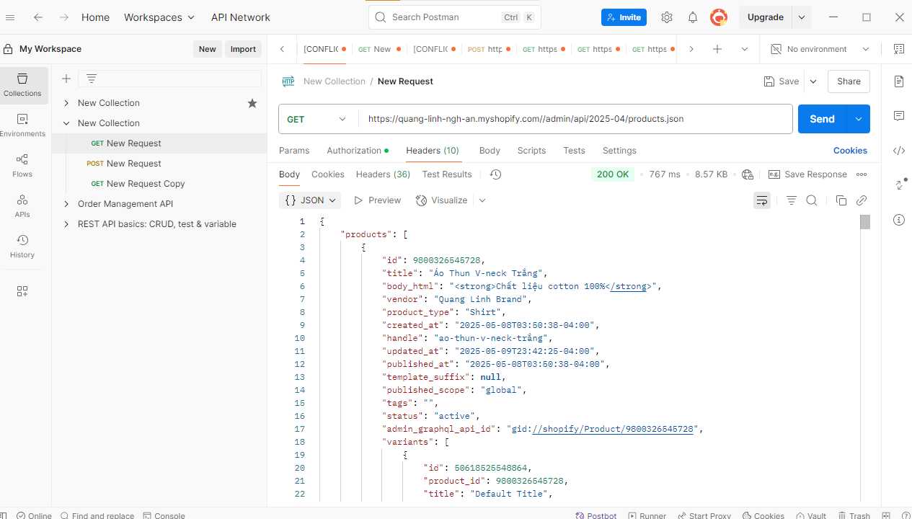

# Day 25: OAuth Flow & Admin API trong Shopify

## 1. Hiểu về OAuth 2.0 Flow trong Shopify App

OAuth 2.0 là giao thức xác thực tiêu chuẩn được Shopify sử dụng để cấp quyền truy cập vào dữ liệu cửa hàng. Luồng OAuth trong Shopify gồm các bước sau:

### 1.1. Tổng quan OAuth Flow

1. **Khởi tạo**: App chuyển hướng merchant đến URL xác thực Shopify.  
2. **Xác thực**: Merchant đồng ý cấp quyền cho app.  
3. **Nhận Authorization Code**: Shopify trả về authorization code qua URL callback.  
4. **Đổi Authorization Code lấy Access Token**: App sử dụng code để lấy permanent access token.  
5. **Sử dụng Access Token**: App dùng token để gọi Shopify API.  

### 1.2. Chi tiết từng bước

#### Bước 1: Tạo URL xác thực

```
https://{shop}.myshopify.com/admin/oauth/authorize?
  client_id={api_key}&
  scope={scopes}&
  redirect_uri={redirect_uri}&
  state={nonce}
```

- `{shop}`: Tên cửa hàng Shopify.  
- `{api_key}`: API key của app (từ Partner Dashboard).  
- `{scopes}`: Các quyền cần thiết (VD: `read_products`, `write_orders`).  
- `{redirect_uri}`: URL callback đã đăng ký.  
- `{nonce}`: Chuỗi ngẫu nhiên để ngăn CSRF attacks.  

#### Bước 2: Nhận Authorization Code

Sau khi merchant đồng ý, Shopify chuyển hướng về `redirect_uri` kèm theo `code` (authorization code).

#### Bước 3: Đổi Code lấy Access Token

```
POST https://{shop}.myshopify.com/admin/oauth/access_token
```

**Body (JSON):**

```json
{
  "client_id": "{api_key}",
  "client_secret": "{api_secret}",
  "code": "{authorization_code}"
}
```

#### Bước 4: Nhận Access Token

Shopify trả về access token:

```json
{
  "access_token": "abcd1234...",
  "scope": "read_products,write_orders"
}
```

---

## 2. Lấy Access Token thủ công

### 2.1. Sử dụng Postman

#### Bước 1: Khởi tạo quá trình OAuth

Truy cập URL trong trình duyệt:

```
https://{shop}.myshopify.com/admin/oauth/authorize?client_id={api_key}&scope=read_products,write_products&redirect_uri={redirect_uri}&state=12345
```

Đăng nhập và cấp quyền cho app.

#### Bước 2: Lấy Authorization Code

Sau khi cấp quyền, trình duyệt chuyển hướng đến:

```
{redirect_uri}?code={authorization_code}&state=12345
```

Sao chép `code` từ URL.

#### Bước 3: Đổi Code lấy Access Token trong Postman

Tạo POST request đến:

```
https://{shop}.myshopify.com/admin/oauth/access_token
```

**Body (JSON):**

```json
{
  "client_id": "{api_key}",
  "client_secret": "{api_secret}",
  "code": "{authorization_code}"
}
```

Gửi request và nhận access token.

### 2.2. Sử dụng CLI (curl)

```bash
curl -X POST \
  https://{shop}.myshopify.com/admin/oauth/access_token \
  -H 'Content-Type: application/json' \
  -d '{
    "client_id": "{api_key}",
    "client_secret": "{api_secret}",
    "code": "{authorization_code}"
  }'
```

---

## 3. Gọi thử Admin API

### 3.1. Lấy danh sách sản phẩm (GET `/admin/api/2025-04/products.json`)

#### Sử dụng Postman:

- Tạo GET request đến:  
  ```
  https://{shop}.myshopify.com/admin/api/2025-04/products.json
  ```
- Thêm header:  
  ```
  X-Shopify-Access-Token: {access_token}
  ```
- Gửi request và xem kết quả.

#### Sử dụng curl:

```bash
curl -X GET \
  https://{shop}.myshopify.com/admin/api/2025-04/products.json \
  -H 'X-Shopify-Access-Token: {access_token}'
```

### 3.2. Tạo sản phẩm mới (POST `/admin/api/2025-04/products.json`)

#### Sử dụng Postman:

- Tạo POST request đến:  
  ```
  https://{shop}.myshopify.com/admin/api/2025-04/products.json
  ```
- Thêm header:  
  ```
  X-Shopify-Access-Token: {access_token}
  ```
- **Body (JSON):**

```json
{
  "product": {
    "title": "Test Product",
    "body_html": "<p>Test description</p>",
    "vendor": "Test Vendor",
    "product_type": "Test Type",
    "status": "draft"
  }
}
```

### 3.3. Sử dụng GraphQL Admin API

#### Sử dụng Postman:

- Tạo POST request đến:  
  ```
  https://{shop}.myshopify.com/admin/api/2025-04/graphql.json
  ```
- Thêm header:  
  ```
  X-Shopify-Access-Token: {access_token}
  ```
- **Body (GraphQL):**

```graphql
{
  "query": "{ shop { name id } products(first: 5) { edges { node { id title handle } } } }"
}
```

---

## 4. Cơ chế xác thực và bảo mật trong Shopify App

### 4.1. Các biện pháp bảo mật quan trọng

- Luôn sử dụng HTTPS cho tất cả các giao tiếp với Shopify API.  
- Xác thực webhook bằng HMAC để đảm bảo tính xác thực của dữ liệu.  
- Lưu trữ an toàn Access Token - không bao giờ phơi bày token trong frontend code.  
- Xác minh tham số `shop` trước khi đổi code lấy token để tránh CSRF attacks.  
- Sử dụng tham số `state` trong OAuth flow để ngăn chặn tấn công CSRF.  

### 4.2. Xác thực Webhook

Shopify gửi header `X-Shopify-Hmac-Sha256` với mỗi webhook. Để xác thực:

```javascript
const crypto = require('crypto');

const verifyWebhook = (data, hmacHeader, apiSecret) => {
  const hmac = crypto.createHmac('sha256', apiSecret)
    .update(data, 'utf8', 'hex')
    .digest('base64');
  
  return hmac === hmacHeader;
};
```

### 4.3. Rate Limiting và API Usage

- Shopify áp dụng rate limiting dựa trên bucket model.  
- Mỗi request trả về header chỉ ra trạng thái rate limit:  
  ```
  X-Shopify-Shop-Api-Call-Limit: "1/40" (1 req đã dùng trong 40 req cho phép)
  ```

**Thực hành tốt nhất:**

- Tránh các request song song đến cùng một shop.  
- Sử dụng bulking khi có thể.  
- Triển khai retry logic với exponential backoff.  

### 4.4. Session Management

- Lưu trữ shop domain và access token trong session server-side.  
- Xác thực mỗi request từ merchant để đảm bảo họ có quyền truy cập dữ liệu cửa hàng.  
- Không lưu trữ access token ở client-side.  

---

## 5. Bài tập thực hành

1. Cài đặt một Custom App thông qua Shopify Admin (không cần code OAuth flow).  
2. Lấy Access Token và thực hiện các API calls sau:  
   - Lấy danh sách sản phẩm.  
   - Tạo một sản phẩm mới.  
   - Cập nhật một sản phẩm.  
   - Lấy danh sách đơn hàng.  
3. Tìm hiểu về GraphQL Admin API và viết một query để lấy các thông tin cửa hàng.  

---

## 6. Tài liệu tham khảo

- [Shopify OAuth Documentation](https://shopify.dev/docs/api/usage/authentication)  
- [Shopify Admin API Reference](https://shopify.dev/docs/api/admin-rest)  
- [Shopify GraphQL Admin API Reference](https://shopify.dev/docs/api/admin-graphql)  
- [Shopify API Rate Limits](https://shopify.dev/docs/api/usage/rate-limits)  