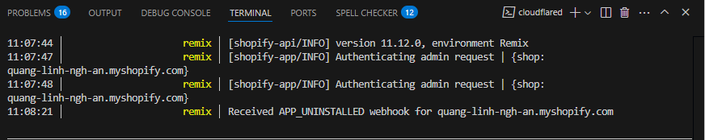

import React from 'react';

# Shopify Webhooks - Tích hợp thông báo sự kiện từ Shopify

## 1. Tổng quan về Webhook trong Shopify

Webhook là cơ chế cho phép Shopify thông báo cho ứng dụng của bạn khi có sự kiện xảy ra trên cửa hàng. Đây là phương thức giao tiếp một chiều từ Shopify đến ứng dụng của bạn.

**Cách webhook hoạt động:**
1. Bạn đăng ký webhook cho các sự kiện cụ thể (VD: đơn hàng mới)
2. Khi sự kiện đó xảy ra, Shopify gửi HTTP POST request đến endpoint của bạn
3. Request chứa data liên quan đến sự kiện (JSON payload)
4. Ứng dụng của bạn xử lý data và thực hiện các hành động phù hợp

Webhook cung cấp các lợi ích sau:
- Nhận thông báo real-time khi có sự kiện xảy ra
- Giảm việc phải liên tục gọi API để kiểm tra sự thay đổi (polling)
- Đồng bộ hóa dữ liệu giữa Shopify và hệ thống của bạn
- Tự động hóa quy trình kinh doanh dựa trên các sự kiện

---

## 2. Đăng ký webhook trong Shopify

Có hai cách chính để đăng ký webhook trong Shopify:

### A. Đăng ký webhook bằng REST API

```js
// Đăng ký webhook bằng REST API
const response = await admin.rest.resources.Webhook.create({
    webhook: {
        topic: "orders/create",
        address: "https://your-app-url.com/webhooks/orders-create",
        format: "json"
    }
});
```

### B. Đăng ký webhook bằng GraphQL API

```js
// Đăng ký webhook bằng GraphQL API
const response = await admin.graphql(`
    mutation {
        webhookSubscriptionCreate(
            topic: ORDERS_CREATE
            webhookSubscription: {
                callbackUrl: "https://your-app-url.com/webhooks/orders-create",
                format: JSON
            }
        ) {
            webhookSubscription {
                id
            }
            userErrors {
                field
                message
            }
        }
    }
`);
```

**Chú ý:**
- URL callback phải là HTTPS và có thể truy cập công khai
- URL callback phải trả về HTTP status 200 trong vòng 5 giây
- Xử lý webhook nên được thực hiện bất đồng bộ để tránh timeout
- Shopify sẽ thử lại gửi webhook tối đa 19 lần trong 48 giờ nếu endpoint không phản hồi thành công

---

## 3. Xử lý webhook trong Remix App

Trong Remix App, bạn cần tạo các resource routes để xử lý webhook từ Shopify:

```js
// app/routes/webhooks.orders-create.tsx
import { json } from "@remix-run/node";
import { authenticate } from "../shopify.server";

export const action = async ({ request }) => {
    const { topic, shop, payload } = await authenticate.webhook(request);

    if (!topic || topic !== "orders/create") {
        return json({ message: "Invalid webhook" }, { status: 400 });
    }

    try {
        // Log dữ liệu webhook nhận được
        console.log("Received order webhook:", payload);

        // Xử lý đơn hàng mới
        const order = payload;
        await processNewOrder(order, shop);

        return json({ success: true }, { status: 200 });
    } catch (error) {
        console.error("Error processing webhook:", error);
        return json({ error: error.message }, { status: 500 });
    }
};

// Hàm xử lý đơn hàng mới
async function processNewOrder(order, shop) {
    // Thực hiện các tác vụ cần thiết với đơn hàng
    // - Lưu vào database
    // - Gửi thông báo
    // - Cập nhật inventory
    // ...
}

// Remix yêu cầu export default function
export default function OrdersCreateWebhook() {
    return null; // Route này là API endpoint, không có UI
}
```

Để xử lý hiệu quả các webhook, cần lưu ý:
- Xác thực webhook để đảm bảo chúng thực sự đến từ Shopify
- Trả về HTTP 200 ngay khi có thể, xử lý logic phức tạp sau
- Sử dụng hàng đợi (queue) nếu xử lý webhook cần nhiều thời gian
- Lưu log để debug và theo dõi

```js
// app/shopify.server.ts - Đoạn code xác thực webhook
// Hàm này được cung cấp bởi shopify-remix-auth

export const authenticate = shopify.authenticate;

// Sử dụng:
const { topic, shop, payload } = await authenticate.webhook(request);
```

---

## 4. Các webhook quan trọng trong Shopify

Dưới đây là các webhook phổ biến và quan trọng trong Shopify:

| Webhook Topic      | Mô tả                                 | Ứng dụng                                      |
|--------------------|---------------------------------------|-----------------------------------------------|
| orders/create      | Kích hoạt khi đơn hàng mới được tạo    | Đồng bộ đơn hàng, thông báo, cập nhật kho      |
| orders/update      | Kích hoạt khi đơn hàng được cập nhật   | Theo dõi thay đổi trạng thái đơn hàng          |
| app/uninstalled    | Kích hoạt khi ứng dụng bị gỡ bỏ        | Dọn dẹp dữ liệu, hủy subscription              |
| customers/create   | Kích hoạt khi khách hàng mới đăng ký   | Đồng bộ khách hàng, chương trình thành viên    |
| products/update    | Kích hoạt khi sản phẩm được cập nhật   | Đồng bộ dữ liệu sản phẩm, cập nhật cache       |
| shop/update        | Kích hoạt khi thông tin shop thay đổi  | Cập nhật thông tin cửa hàng trong hệ thống     |

**Webhook app/uninstalled:**

Webhook này đặc biệt quan trọng để xử lý khi người dùng gỡ bỏ ứng dụng:
- Xóa hoặc đánh dấu dữ liệu của merchant
- Hủy bỏ các subscription hoặc thanh toán định kỳ
- Giải phóng tài nguyên không cần thiết
- Tuân thủ các quy định về bảo mật dữ liệu

---

## 5. Thực hành: Đăng ký và xử lý webhook orders/create

Dưới đây là một ví dụ hoàn chỉnh để đăng ký và xử lý webhook orders/create trong ứng dụng Remix Shopify:

### Bước 1: Đăng ký webhook khi app được cài đặt

```js
// app/routes/app._index.tsx
import { useEffect } from "react";
import { json, type LoaderFunctionArgs } from "@remix-run/node";
import { useLoaderData, useSubmit } from "@remix-run/react";
import { authenticate } from "../shopify.server";

export async function loader({ request }: LoaderFunctionArgs) {
    const { admin, session } = await authenticate.admin(request);

    // Kiểm tra xem đã đăng ký webhook chưa
    const webhooksResponse = await admin.rest.resources.Webhook.all({
        session: session
    });

    const hasOrdersCreateWebhook = webhooksResponse.data.some(
        webhook => webhook.topic === "orders/create"
    );

    return json({
        hasOrdersCreateWebhook
    });
}

export async function action({ request }) {
    const { admin, session } = await authenticate.admin(request);
    const formData = await request.formData();
    const action = formData.get("action");

    if (action === "register_webhook") {
        // Lấy host URL từ request
        const host = session.shop.replace(".myshopify.com", "");
        const baseUrl = `https://${host}.ngrok.io`; // Thay đổi theo URL thực tế

        // Đăng ký webhook
        const response = await admin.rest.resources.Webhook.create({
            session: session,
            webhook: {
                topic: "orders/create",
                address: `${baseUrl}/webhooks/orders-create`,
                format: "json"
            }
        });

        console.log("Webhook registration response:", response);

        return json({ success: true });
    }

    return json({ error: "Invalid action" }, { status: 400 });
}

export default function Index() {
    const { hasOrdersCreateWebhook } = useLoaderData<typeof loader>();
    const submit = useSubmit();

    // Đăng ký webhook nếu chưa đăng ký
    useEffect(() => {
        if (!hasOrdersCreateWebhook) {
            const formData = new FormData();
            formData.append("action", "register_webhook");
            submit(formData, { method: "post" });
        }
    }, [hasOrdersCreateWebhook, submit]);

    return (
        <div>
            {/* ... UI của app ... */}
            {hasOrdersCreateWebhook ? (
                <p>Webhook orders/create đã được đăng ký</p>
            ) : (
                <p>Đang đăng ký webhook...</p>
            )}
        </div>
    );
}
```

### Bước 2: Tạo endpoint xử lý webhook orders/create

```js
// app/routes/webhooks.orders-create.tsx
import { json } from "@remix-run/node";
import { authenticate } from "../shopify.server";
import { prisma } from "../db.server"; // Giả sử bạn dùng Prisma

export const action = async ({ request }) => {
    // Xác thực webhook từ Shopify
    const { topic, shop, payload } = await authenticate.webhook(request);

    // Kiểm tra topic
    if (!topic || topic !== "orders/create") {
        console.log(`Unexpected webhook topic: ${topic}`);
        return json({ message: "Invalid webhook" }, { status: 400 });
    }

    try {
        // Log payload nhận được
        console.log(`Received orders/create webhook from ${shop}:`, JSON.stringify(payload, null, 2));

        // Lưu đơn hàng vào database
        await prisma.order.create({
            data: {
                shopDomain: shop,
                orderId: payload.id.toString(),
                orderNumber: payload.order_number,
                customerEmail: payload.email,
                totalPrice: parseFloat(payload.total_price),
                createdAt: new Date(payload.created_at),
                rawData: JSON.stringify(payload)
            }
        });

        console.log(`Order ${payload.order_number} saved to database`);

        return json({ success: true });
    } catch (error) {
        console.error("Error processing orders/create webhook:", error);
        // Vẫn trả về 200 để Shopify không gửi lại webhook
        return json({ success: false, error: error.message });
    }
};

// Remix yêu cầu export default function
export default function OrdersCreateWebhook() {
    return null;
}
```

### Bước 3: Xử lý webhook app/uninstalled

```js
// app/routes/webhooks.app-uninstalled.tsx
import { json } from "@remix-run/node";
import { authenticate } from "../shopify.server";
import { prisma } from "../db.server";

export const action = async ({ request }) => {
    const { topic, shop } = await authenticate.webhook(request);

    if (!topic || topic !== "app/uninstalled") {
        return json({ message: "Invalid webhook" }, { status: 400 });
    }

    try {
        console.log(`App uninstalled from shop: ${shop}`);

        // Đánh dấu merchant là inactive trong database
        await prisma.shop.update({
            where: { domain: shop },
            data: { isActive: false, uninstalledAt: new Date() }
        });

        // Thực hiện các tác vụ cleanup khác
        // - Hủy subscription nếu có
        // - Xóa dữ liệu nếu cần

        return json({ success: true });
    } catch (error) {
        console.error(`Error handling app/uninstalled for ${shop}:`, error);
        return json({ success: false, error: error.message });
    }
};

export default function AppUninstalledWebhook() {
    return null;
}
```
### Đăng ký webhook `app/uninstalled` bằng GraphQL

**GraphQL mutation:**
```graphql
mutation webhookSubscriptionCreate($topic: WebhookSubscriptionTopic!, $webhookSubscription: WebhookSubscriptionInput!) {
    webhookSubscriptionCreate(topic: $topic, webhookSubscription: $webhookSubscription) {
        webhookSubscription {
            id
            endpoint {
                __typename
                ... on WebhookHttpEndpoint {
                    callbackUrl
                }
            }
        }
        userErrors {
            field
            message
        }
    }
}
```

**Biến truyền vào:**
```json
{
    "topic": "APP_UNINSTALLED",
    "webhookSubscription": {
        "callbackUrl": "https://patrol-output-cowboy-dakota.trycloudflare.com/webhooks/app/uninstalled",
        "format": "JSON"
    }
}
```

**Các bước thực hiện:**
1. Gửi mutation trên đến Shopify GraphQL Admin API để đăng ký webhook cho sự kiện `app/uninstalled`.
2. Đăng nhập vào Shopify Partner, truy cập Dev Store, vào mục App và tiến hành gỡ cài đặt (uninstall) app.
3. Kiểm tra log tại endpoint webhook để xác nhận đã nhận được thông báo từ Shopify.

**Kết quả ví dụ:**

---

## 6. Bài tập thực hành

**Yêu cầu:**
1. Đăng ký webhook `orders/create` trong ứng dụng Remix Shopify
2. Tạo endpoint để xử lý webhook và log dữ liệu nhận được ra console
3. Tạo thêm một webhook cho sự kiện `products/update` để theo dõi khi sản phẩm được cập nhật
4. Đảm bảo xử lý lỗi đúng cách và trả về mã HTTP phù hợp
5. Bonus: Lưu dữ liệu webhook nhận được vào database

---

## Kiến thức bổ sung

- Shopify khuyến nghị sử dụng GraphQL API cho webhook thay vì REST API
- Để test webhook trên môi trường local, bạn có thể sử dụng ngrok hoặc cloudflare tunnel
- Shopify Webhook có yêu cầu HMAC signature để bảo mật
- Tốt nhất nên sử dụng job queue (như Bull, Bee Queue) để xử lý webhook bất đồng bộ
