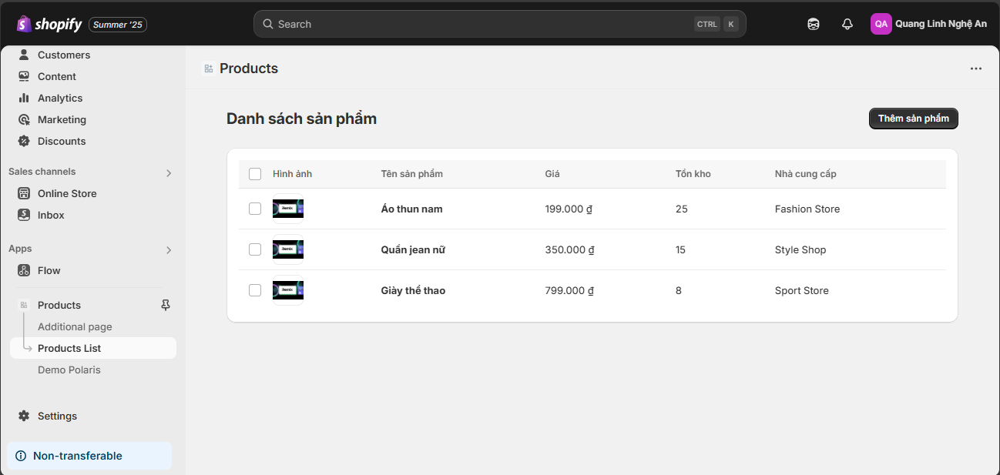
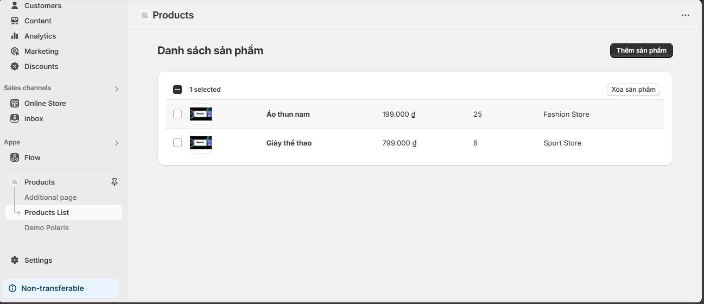
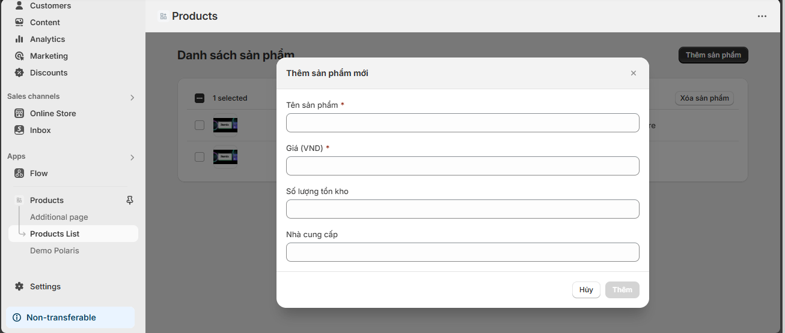

# Day 28: Shopify Polaris & UI Advanced

## 📋 Mục tiêu học tập

Trong ngày học thứ 28, chúng ta sẽ tìm hiểu về **Shopify Polaris Design System** và cách tích hợp nó với **Remix** để xây dựng giao diện người dùng chuyên nghiệp cho ứng dụng Shopify.

---

## 🎯 Nội dung chính

### 1. Tìm hiểu Polaris Design System

**Shopify Polaris** là một design system toàn diện được Shopify phát triển để đảm bảo tính nhất quán trong trải nghiệm người dùng trên tất cả các sản phẩm của họ.

**Đặc điểm chính của Polaris:**
- **Consistency:** Đảm bảo giao diện nhất quán
- **Accessibility:** Tuân thủ các tiêu chuẩn truy cập
- **Performance:** Tối ưu hiệu suất
- **Developer Experience:** Dễ sử dụng và tích hợp

**Cài đặt Polaris:**
```bash
npm install @shopify/polaris
# hoặc
yarn add @shopify/polaris
```

---

### 2. Các Component quan trọng

#### 2.1 Card Component

```jsx
import { Card } from '@shopify/polaris';

function ProductCard() {
  return (
    <Card title="Thông tin sản phẩm">
      <Card.Section>
        <p>Nội dung của card</p>
      </Card.Section>
    </Card>
  );
}
```

#### 2.2 ResourceList Component

```jsx
import { ResourceList, ResourceItem, TextStyle } from '@shopify/polaris';

function ProductList({ products }) {
  return (
    <ResourceList
      resourceName={{ singular: 'product', plural: 'products' }}
      items={products}
      renderItem={(item) => {
        const { id, name, price } = item;
        return (
          <ResourceItem id={id} url={`/products/${id}`}>
            <h3>
              <TextStyle variation="strong">{name}</TextStyle>
            </h3>
            <div>{price}</div>
          </ResourceItem>
        );
      }}
    />
  );
}
```

#### 2.3 Form Components

```jsx
import { Form, FormLayout, TextField, Button } from '@shopify/polaris';

function ProductForm() {
  return (
    <Form onSubmit={handleSubmit}>
      <FormLayout>
        <TextField
          value={name}
          onChange={setName}
          label="Tên sản phẩm"
          type="text"
        />
        <TextField
          value={price}
          onChange={setPrice}
          label="Giá"
          type="number"
        />
        <Button submit>Lưu sản phẩm</Button>
      </FormLayout>
    </Form>
  );
}
```

#### 2.4 Modal Component

```jsx
import { Modal, TextContainer } from '@shopify/polaris';

function ProductModal({ active, onClose }) {
  return (
    <Modal
      open={active}
      onClose={onClose}
      title="Thêm sản phẩm mới"
      primaryAction={{
        content: 'Thêm',
        onAction: handleAdd,
      }}
      secondaryActions={[
        {
          content: 'Hủy',
          onAction: onClose,
        },
      ]}
    >
      <Modal.Section>
        <TextContainer>
          <p>Form thêm sản phẩm sẽ được đặt ở đây</p>
        </TextContainer>
      </Modal.Section>
    </Modal>
  );
}
```

---

### 3. Kết hợp Polaris + Remix

#### 3.1 Setup trong Remix App

```jsx
// app/root.tsx
import { Links, LiveReload, Meta, Outlet, Scripts } from '@remix-run/react';
import polarisStyles from '@shopify/polaris/build/esm/styles.css';

export function links() {
  return [{ rel: 'stylesheet', href: polarisStyles }];
}

// app/components/AppProvider.tsx
import { AppProvider } from '@shopify/polaris';
import enTranslations from '@shopify/polaris/locales/en.json';

export function PolarisAppProvider({ children }) {
  return (
    <AppProvider i18n={enTranslations}>
      {children}
    </AppProvider>
  );
}
```

#### 3.2 Tích hợp trong Layout

```jsx
// app/routes/_index.tsx
import { Page, Layout, Card } from '@shopify/polaris';

export default function Dashboard() {
  return (
    <Page title="Dashboard">
      <Layout>
        <Layout.Section>
          <Card title="Thống kê">
            <Card.Section>
              <p>Nội dung thống kê</p>
            </Card.Section>
          </Card>
        </Layout.Section>
      </Layout>
    </Page>
  );
}
```

---

## 🔨 Bài tập thực hành

### Bài tập 1: Render danh sách Product bằng Polaris ResourceList

**Mục tiêu:** Tạo một component hiển thị danh sách sản phẩm sử dụng ResourceList của Polaris.

**Yêu cầu:**
- Tạo mock data cho danh sách sản phẩm
- Sử dụng ResourceList để hiển thị
- Mỗi item hiển thị: tên, giá, mô tả ngắn
- Thêm tính năng tìm kiếm và lọc

**Gợi ý code:**

```jsx
// app/routes/products._index.tsx
import { useState } from 'react';
import { Page, ResourceList, ResourceItem, TextStyle, Filters } from '@shopify/polaris';

const mockProducts = [
  { id: '1', name: 'iPhone 14', price: '$999', description: 'Flagship smartphone' },
  { id: '2', name: 'MacBook Pro', price: '$2499', description: 'Professional laptop' },
  // Thêm data...
];

export default function ProductsPage() {
  const [products, setProducts] = useState(mockProducts);
  const [searchValue, setSearchValue] = useState('');

  const filteredProducts = products.filter(product =>
    product.name.toLowerCase().includes(searchValue.toLowerCase())
  );

  return (
    <Page title="Danh sách sản phẩm">
      <ResourceList
        resourceName={{ singular: 'product', plural: 'products' }}
        items={filteredProducts}
        renderItem={renderProduct}
        filterControl={
          <Filters
            queryValue={searchValue}
            onQueryChange={setSearchValue}
            queryPlaceholder="Tìm kiếm sản phẩm..."
          />
        }
      />
    </Page>
  );
}

function renderProduct(item) {
  const { id, name, price, description } = item;
  
  return (
    <ResourceItem id={id} url={`/products/${id}`}>
      <div style={{ display: 'flex', alignItems: 'center' }}>
        <div style={{ flex: 1 }}>
          <h3>
            <TextStyle variation="strong">{name}</TextStyle>
          </h3>
          <p>{description}</p>
        </div>
        <TextStyle variation="strong">{price}</TextStyle>
      </div>
    </ResourceItem>
  );
}
```

---

### Bài tập 2: Thêm Button thêm/xóa product giả lập

**Mục tiêu:** Thêm các tính năng CRUD cơ bản cho sản phẩm.

**Yêu cầu:**
- Thêm button "Thêm sản phẩm mới"
- Modal form để thêm sản phẩm
- Button xóa trên mỗi item
- Confirmation modal khi xóa
- Toast notification sau khi thêm/xóa

**Gợi ý code:**

```jsx
// app/routes/products._index.tsx (mở rộng)
import { 
  Page, ResourceList, ResourceItem, Button, Modal, 
  Form, FormLayout, TextField, Toast, Frame 
} from '@shopify/polaris';

export default function ProductsPage() {
  const [products, setProducts] = useState(mockProducts);
  const [showAddModal, setShowAddModal] = useState(false);
  const [showDeleteModal, setShowDeleteModal] = useState(false);
  const [selectedProduct, setSelectedProduct] = useState(null);
  const [showToast, setShowToast] = useState(false);
  const [toastMessage, setToastMessage] = useState('');

  // Form state
  const [productName, setProductName] = useState('');
  const [productPrice, setProductPrice] = useState('');
  const [productDescription, setProductDescription] = useState('');

  const handleAddProduct = () => {
    const newProduct = {
      id: Date.now().toString(),
      name: productName,
      price: productPrice,
      description: productDescription,
    };
    
    setProducts([...products, newProduct]);
    setShowAddModal(false);
    setToastMessage('Sản phẩm đã được thêm thành công!');
    setShowToast(true);
    
    // Reset form
    setProductName('');
    setProductPrice('');
    setProductDescription('');
  };

  const handleDeleteProduct = () => {
    setProducts(products.filter(p => p.id !== selectedProduct.id));
    setShowDeleteModal(false);
    setToastMessage('Sản phẩm đã được xóa!');
    setShowToast(true);
    setSelectedProduct(null);
  };

  const primaryAction = (
    <Button primary onClick={() => setShowAddModal(true)}>
      Thêm sản phẩm
    </Button>
  );

  const toastMarkup = showToast ? (
    <Toast
      content={toastMessage}
      onDismiss={() => setShowToast(false)}
    />
  ) : null;

  return (
    <Frame>
      <Page title="Danh sách sản phẩm" primaryAction={primaryAction}>
        <ResourceList
          resourceName={{ singular: 'product', plural: 'products' }}
          items={products}
          renderItem={(item) => renderProductWithActions(item, setSelectedProduct, setShowDeleteModal)}
        />
      </Page>

      {/* Add Product Modal */}
      <Modal
        open={showAddModal}
        onClose={() => setShowAddModal(false)}
        title="Thêm sản phẩm mới"
        primaryAction={{
          content: 'Thêm',
          onAction: handleAddProduct,
        }}
        secondaryActions={[{
          content: 'Hủy',
          onAction: () => setShowAddModal(false),
        }]}
      >
        <Modal.Section>
          <Form onSubmit={handleAddProduct}>
            <FormLayout>
              <TextField
                value={productName}
                onChange={setProductName}
                label="Tên sản phẩm"
                type="text"
              />
              <TextField
                value={productPrice}
                onChange={setProductPrice}
                label="Giá"
                type="text"
              />
              <TextField
                value={productDescription}
                onChange={setProductDescription}
                label="Mô tả"
                multiline={4}
              />
            </FormLayout>
          </Form>
        </Modal.Section>
      </Modal>

      {/* Delete Confirmation Modal */}
      <Modal
        open={showDeleteModal}
        onClose={() => setShowDeleteModal(false)}
        title="Xác nhận xóa"
        primaryAction={{
          content: 'Xóa',
          destructive: true,
          onAction: handleDeleteProduct,
        }}
        secondaryActions={[{
          content: 'Hủy',
          onAction: () => setShowDeleteModal(false),
        }]}
      >
        <Modal.Section>
          <p>Bạn có chắc chắn muốn xóa sản phẩm "{selectedProduct?.name}"?</p>
        </Modal.Section>
      </Modal>

      {toastMarkup}
    </Frame>
  );
}

function renderProductWithActions(item, setSelectedProduct, setShowDeleteModal) {
  const { id, name, price, description } = item;
  
  return (
    <ResourceItem id={id}>
      <div style={{ display: 'flex', alignItems: 'center', justifyContent: 'space-between' }}>
        <div style={{ flex: 1 }}>
          <h3>
            <TextStyle variation="strong">{name}</TextStyle>
          </h3>
          <p>{description}</p>
        </div>
        <div style={{ display: 'flex', alignItems: 'center', gap: '1rem' }}>
          <TextStyle variation="strong">{price}</TextStyle>
          <Button
            destructive
            size="slim"
            onClick={() => {
              setSelectedProduct(item);
              setShowDeleteModal(true);
            }}
          >
            Xóa
          </Button>
        </div>
      </div>
    </ResourceItem>
  );
}
```

---

### Kết quả minh họa

**Danh sách sản phẩm:**



**Xóa sản phẩm:**



**Thêm sản phẩm:**



---

## 📚 Tài liệu tham khảo

- [Shopify Polaris Documentation](https://polaris.shopify.com/)
- [Polaris Components](https://polaris.shopify.com/components)
- [Polaris Design Tokens](https://polaris.shopify.com/design-tokens)
- [Remix + Polaris Integration Guide](https://remix.run/docs/en/main/guides/styling#using-css-in-js-libraries)

---

## 🎯 Mục tiêu hoàn thành


- Hiểu được các nguyên tắc cơ bản của Polaris Design System
- Sử dụng thành thạo các component chính như Card, ResourceList, Form, Modal
- Tích hợp Polaris vào ứng dụng Remix
- Xây dựng giao diện quản lý sản phẩm cơ bản
- Implement các tính năng CRUD với UX/UI chuẩn Shopify

