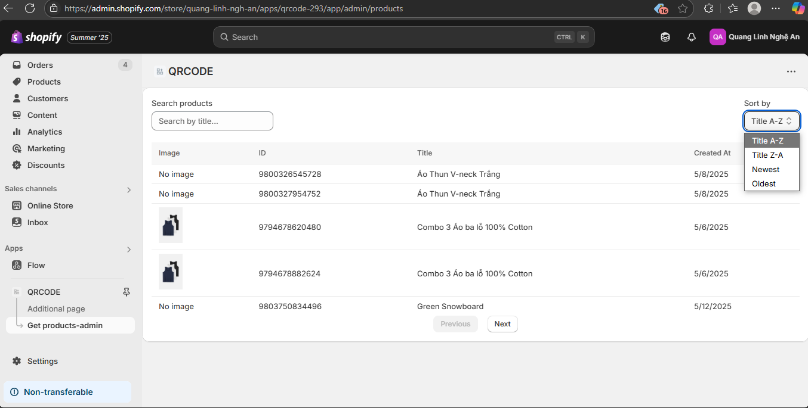

## Hướng dẫn xây dựng tính năng QR Code cho Shopify App với Remix

### 1. Khởi tạo ứng dụng và cấu hình

- **Tạo project Remix:**  
  Sử dụng `npx create-remix@latest`, chọn template Shopify App.
- **Cài đặt thư viện:**  
  - `qrcode`: Tạo QR code  
  - `@shopify/polaris-icons`: Icon giao diện  
  - `tiny-invariant`: Hỗ trợ kiểm tra dữ liệu
- **Cấu hình môi trường:**  
  Thiết lập `.env` với các biến như `SHOPIFY_API_KEY`, `SHOPIFY_API_SECRET`, `SCOPES`, `HOST`, ...

---

### 2. Mở rộng database với Prisma

- **Thêm model QRCode vào `prisma/schema.prisma`:**
  ```prisma
  model QRCode {
    id               Int      @id @default(autoincrement())
    title            String
    shop             String
    productId        String
    productHandle    String
    productVariantId String
    destination      String
    scans            Int      @default(0)
    createdAt        DateTime @default(now())
  }
  ```
- **Chạy migrate:**
  ```bash
  npm run prisma migrate dev -- --name add-qrcode-table
  npm run prisma studio
  ```

---

### 3. Xây dựng model thao tác với QRCode

Tạo file `app/models/QRCode.server.js` với các hàm:

- `getQRCode(id, shop)`: Lấy QRCode theo id và shop
- `getQRCodes(shop)`: Lấy danh sách QRCode của shop
- `getDestinationUrl(qr)`: Sinh URL đích dựa trên trường `destination`
- `getQRCodeImage(url)`: Tạo ảnh QR code base64 từ URL
- `supplementQRCode(qr)`: Lấy thêm thông tin sản phẩm qua GraphQL Admin API
- `validateQRCode(data)`: Kiểm tra dữ liệu hợp lệ

---

### 4. Giao diện quản lý QRCode trong Shopify Admin

#### 4.1. Route tạo/sửa QRCode

- **File:** `app/routes/app/qrcodes.$id.jsx`
- **Loader:** Xác thực, trả về dữ liệu QRCode hoặc form rỗng
- **Action:** Xử lý tạo, cập nhật, xóa QRCode
- **Component:**  
  - Sử dụng hooks Remix (`useLoaderData`, `useActionData`, ...)
  - Quản lý state form, chọn sản phẩm qua ResourcePicker
  - Dùng Polaris UI: `Page`, `Card`, `TextField`, `ChoiceList`, `Thumbnail`, `EmptyState`, `PageActions`
  - App Bridge `TitleBar` hiển thị tiêu đề và breadcrumbs

#### 4.2. Route danh sách QRCode

- **File:** `app/routes/app/index.jsx`
- **Loader:** Lấy danh sách QRCode
- **Component:**  
  - Nếu chưa có QRCode: hiển thị `EmptyState`
  - Nếu có: hiển thị `IndexTable` với các cột: ảnh, tiêu đề, sản phẩm, ngày tạo, số lần scan
  - Nút “Create QR code” dẫn đến `/app/qrcodes/new`

---

### 5. Route công khai cho QRCode

#### 5.1. Hiển thị ảnh QR code

- **File:** `app/routes/qrcodes.$id.jsx`
- **Loader:** Lấy QRCode, trả về ảnh base64
- **Component:** Hiển thị ``

#### 5.2. Xử lý scan và redirect

- **File:** `app/routes/qrcodes.$id.scan.jsx`
- **Loader:** Tăng trường `scans`, redirect đến URL đích

---

### 6. Kiểm thử và chạy ứng dụng

- **Chạy local:**  
  ```bash
  shopify app dev
  ```
- **Test trong admin:**  
  - Tạo, sửa, xóa QR code
  - Kiểm tra redirect, validate form
- **Test scan:**  
  - Truy cập `/qrcodes/{id}` để xem QR code
  - Scan thử, kiểm tra chuyển hướng và số lần scan tăng

---

## Ứng dụng Quản lý Sản phẩm Shopify

### Tính năng chính

- **Danh sách sản phẩm:** Hiển thị bảng sản phẩm với ảnh, ID, tên, ngày tạo
- **Tìm kiếm:** Theo tên, có debounce
- **Sắp xếp:** Theo tên (A-Z/Z-A), ngày tạo (mới/cũ)
- **Phân trang:** Điều hướng qua các trang

### Cài đặt

1. Cài dependencies:
   ```bash
   npm install @shopify/app-bridge-react @shopify/app-bridge-utils @shopify/react-hooks
   ```
2. Chạy server:
   ```bash
   npm run dev
   ```

### Cấu hình

- **Pagination:**  
  ```js
  const pageSize = 5;
  // GraphQL variables: first, last, after, before
  ```
- **Debounce:**  
  ```js
  const [debouncedSearchTerm] = useDebounce(searchTerm, 500);
  ```
- **Sort Options:**  
  ```js
  const sortOptions = [
    { label: 'Tên A-Z', value: 'TITLE-ASC' },
    { label: 'Tên Z-A', value: 'TITLE-DESC' },
    { label: 'Mới nhất', value: 'CREATED_AT-DESC' },
    { label: 'Cũ nhất', value: 'CREATED_AT-ASC' },
  ];
  ```
- **Error Handling:**  
  ```js
  if (errors) {
    throw new Error(errors.map((e) => e.message).join(', '));
  }
  // Hiển thị lỗi trong UI
  {error && (
    <div style={{ margin: '16px 0', padding: '16px', backgroundColor: 'var(--p-color-bg-fill-critical)' }}>
      <Text variant="bodyMd" color="critical">
        <strong>Lỗi:</strong> {error}
      </Text>
    </div>
  )}
  ```

### Query GraphQL mẫu

```graphql
query($first: Int, $last: Int, $after: String, $before: String, $query: String, $sortKey: ProductSortKeys, $reverse: Boolean) {
  products(first: $first, last: $last, after: $after, before: $before, query: $query, sortKey: $sortKey, reverse: $reverse) {
    edges {
      node {
        id
        title
        createdAt
        featuredImage { url }
      }
      cursor
    }
    pageInfo {
      hasNextPage
      hasPreviousPage
      startCursor
      endCursor
    }
  }
}
```

### State Management mẫu

```js
const [products, setProducts] = useState([]);
const [pageInfo, setPageInfo] = useState({
  hasNextPage: false,
  hasPreviousPage: false,
});
const [searchTerm, setSearchTerm] = useState('');
const [sortConfig, setSortConfig] = useState({
  key: 'TITLE',
  direction: 'ASC',
});
```

**Kết quả:**  
Phân trang, filter, search đã được tích hợp.

